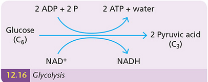

# Respiration

## Introduction

- **External Respiration** is how organisms exchange gases with their environment
- **Internal Respiration** is the controlled release of energy from food

- Controlled by enzymes
  - lets energy get released slowly
- Energy stored by ATP (Adenosine Triphosphate)

$$
6H*2O + C_6H*{12}O_6 \longrightarrow H_2O + CO_2
$$

## Aerobic Respiration

- **Aerobic Respiration** is the release of energy from food **using oxygen**
- Energy is stored as ATP
- Aerobic respiration is relatively efficient
- It's a 2 stage process

### Stage 1 (Glycolosis)

- Anaerobic stage (doesn't require oxygen)
- Releases onyl a small amount of energy
- Takes place in the cytosol
- Involves splitting glucose (six-carbon sugar) into three-carbon molecules
  - Small amount of energy released (ATP)
- Produces pyruvic acid, which can be turned into pyruvate
- 

### Stage 2

#### Summary

- Aerobic process
- Large amount of energy released
  - Efficient
- Takes place in the mitochondria
- Involves breaking down 3-carbon molecules into CO2 and H2O

#### Main Events

- Pyruvic acid enters a mitochondrion
  - Loses a CO2 molecule to form a 2-carbon molecule
    - **Acetyl coenzyme A**
- Pyrivic acid also loses 2 high-energy electrons and a proton (H+)
  - These combine with NAD+ to form NADH

## Anaerobic Respiration

- **Anaerobic Respiration** is the release of energy from food without the use of oxygen
  - AKA **Fermentation**
- Stage 1 process only
- Takes place in the cytosol
- Small amount of energy released
- Many forms of anaerobic respiration
  - They all break glucose down into 3-carbon molecules
  - 3-carbon molecules are broken down into different end products
    - No additional energy released
- Two common forms of anaerobic respiration
  - Lactic acid fermentation (often called anerobic respiration)
  - Alcohol fermentation

### Lactic Acid Fermentation

- Occurs in some bacteria and fungi (anerobes) and also in human muscle when it is low on oxygen
- 3-carbon molecules are converted into lactic acid
- Lactic acid fermentation causes a build up of lactic acid, causing cramp
- When we rest, lactic acid is broken down in the liver
- Glucose >>> **2 lactic acid** + small amount of energy

### Alcohol Fermentation

- Takes place in some bacteria and fungi (e.g. yeast) and in plants when low on oxygen
- 3-carbon molecule converted into **ethanol and CO2**
- Ethanol is a high energy product
- Glucose >>> **2 ethanol + 2 carbon dioxide** + small amount of energy

## Micro-Organisms in industrial fermentation

- **Biotechnology** is the use of living things to manufacture useful products or to carry out useful reactions

### Production Method

- Micro-organisms are palced in a container along with suitable substrates to react
  - The container is called a **bioreactor**
- Contents are mixed
  - This produces foam
  - Foam breaker removes foam
- Oxygen is pumped sinto the liquid so the reactions happen better

### Bioprocessing with immobilised cells

- Traditionally, micro-organisms are mixed in with ingredients
  - They have to be separated and thrown out after the reaction
    - Very costly
- Nowadays,, microorganisms are **immobilised**

## Detailed Study of Respiration
