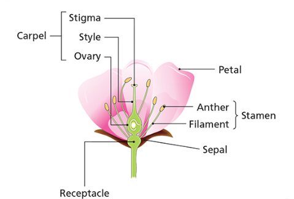
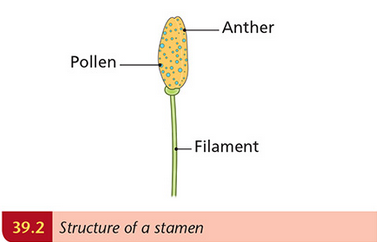
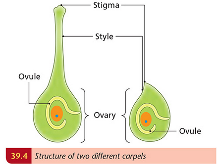

# Sexual Reproduction In Flowering Plants

## Asexual and Sexual Reproduction

### Asexual

- Only involves one parent
- Doesn't require meiosis
- Does not involve sex cells
- Offspring genetically identical

### Sexual Reproduction

- Involves the union of two sex cells (gametes)
- Two parents
- Meiosis is essential for formation of gametes
- Gametes fuse to form a zygote
- Offspring show **variations**
  - Sexual reproduction is better than Asexual
    - Variations result in a stronger species

## Structures and functions of parts of a flower

### Receptacle

- The part of the flower from which the flowering parts arise

### Sepals

- Originally green, but turn brown
- They protect the flower when its a bud

### Petals

- In animal-pollinated plants;
  - Petals are large and colourful (attracts insects)
- In wind-pollinated plants;
  - Petals are small (or non-existent) and green

### Stamens

- **Stamens** are the male parts of the flower
  - Consists of:
    - Thin stalk (**filament**)
      - Contains vascular bundle
    - **Anther** produces pollen grains  
      

### Carpels

- The female part of the flower
- Consists of three parts:
  - A **stigma**, where pollen lands
  - A **style**, through which the pollen tube grows
  - An **ovary**, which contains one or more ovules  
    
