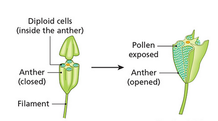

# Sexual Reproduction In Flowering Plants

## Asexual and Sexual Reproduction

### Asexual

- Only involves one parent
- Doesn't require meiosis
- Does not involve sex cells
- Offspring genetically identical

### Sexual Reproduction

- Involves the union of two sex cells (gametes)
- Two parents
- Meiosis is essential for formation of gametes
- Gametes fuse to form a zygote
- Offspring show **variations**
  - Sexual reproduction is better than Asexual
    - Variations result in a stronger species

## Structures and functions of parts of a flower

### Receptacle

- The part of the flower from which the flowering parts arise

### Sepals

- Originally green, but turn brown
- They protect the flower when its a bud

### Petals

- In animal-pollinated plants;
  - Petals are large and colourful (attracts insects)
- In wind-pollinated plants;
  - Petals are small (or non-existent) and green

### Stamens

- **Stamens** are the male parts of the flower
  - Consists of:
    - Thin stalk (**filament**)
      - Contains vascular bundle
    - **Anther** produces pollen grains  
      

### Carpels

- The female part of the flower
- Consists of three parts:
  - A **stigma**, where pollen lands
  - A **style**, through which the pollen tube grows
  - An **ovary**, which contains one or more ovules  
    

## Formation of gametes (sex cells)

### Male gamete formation

- Cells in the anther are **diploid**
- Meiosis takes place to produce **pollen grains** (haploid)
- When pollen grains are fully developed, the anther opens, exposing the pollen grains

#### Structure of Pollen Sac

- Anthers consists of 4 chambers (**pollen sacs**)
- Each sac enclosed by epidermis, fibrous layer and a tapetum

#### Pollen Grain Development

- Inside pollen sacs, there are some **diploid microspore mother cells**
- They divide by meiosis to form 4 haploid cells, called a **tetrad**
  - Tetrads break up to form 4 separate haploid pollen grains (also called microspores)
- Each pollen grain divides by mitosis to form 2 haploid nuclei
  - **tube nuclei**
  - **generative nuclei**
  - Both haploid
- Tube nucleous will form the **pollen tube**
- Generative nucleous divides by mitosis to form the male gametes (sperm nuclei)  
  

#### Structure of the Pollen Grain

- Thick outer wall (**exine**)
  - specific pattern to each plant
  - very strong
- Thin inner coat (**intine**)
- Pollen grains are NOT gametes (they don't join with other cells)
  - they contain the male gametes (sperm nuclei) though
- When pollen grains mature, the walls of the anther shrivel and split open
  - Pollen grains are exposed

### Female Gamete Formation

#### Development of the Embryo Sac

  

- Ovule composed of diploid cells
- One of these cells divide by meiosis to form a single haploid cell (**embryo sac**)
- Embryo sac undergoes mitosis 3 times to form 8 haploid nuclei
  - 5 die
  - 3 remain
    - 1 egg cell
    - 2 polar nuclei
- When the embryo sac is mature, the carpel will look like the diagram below
  

#### Structure of the Ovule

- 2 walls (**integuments**)
- Integuments have a small opening (**microplye**)
  - pollen tubes enter here
- Bulk of ovule is diploid nucleus cells
- One cell is called the **megaspore mother cell**

## Pollination

- **Pollination** is the transfer of pollen from an anther to a stigma of a flower of the same species
- **Self-Pollination** is the transfer of pollen from an anther to a stigma of the **same plant**
- **Cross-Pollination** is the transfer of pollen from an anther to a stigma of a **different plant**
- Self-pollination is an extreme form of inbreeding
  - Offspring are weak
- Cross-pollination leads to strong, varied offspring

### Methods of Pollination

- Plants use either wind or animals (insects) to get the male gametes to the female gametes

#### Wind

- Wind can be very wasteful of pollen

#### Animals

- Less pollen wasted

#### Wind / Animal Pollination

  

## Fertilisation

- **Fertilisation** is the union of male and female gametes to form a diploid zygote
