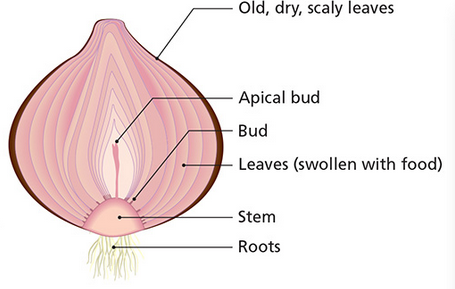

# Vegetative Propagation

- **Vegetative propagation** (reproduction) is asexual reproduction in plants
- **Natural vegetative reporduction** inviolves forming a new plant from a stem, leaf, root or bud

## Introduction

- No gametes involved
- Only one plant necessary (asexual)
- A part of the plant grows away from the parent and divides by mitosis to form a new plant
  - The daughter plant is genetically identical

## Natural Vegetative Propagation

### Methods of Natural Vegetative Proapgation

#### Runners

- **Runners** are horizontal stems that run (grow) above ground and from which new plants grow
- Have long internodes (distance between nodes/buds)
- Buds are formed at each node
- Buds may give rise to a new plant
- Eventually, these plants give rise to their own runners

#### Roots

- A **root tuber** is a swollen, underground root that remains dormant during winter and from which new plants may grow

#### Leaf

- If you detatch a leaf from certain plants and plant in the ground, they may give rise to a new plant

#### Buds

- A **bulb** is a modified bud
- A bulb contains a small, underground stem
- Leaves are swollen with food
- Old leaves (outside) protect the younger leaves
- Each bulb contains at least one bud
  - If more than one bud grows, each one will form a new shoot
  - Farmers may have to dig up extra buds and replant to avoid overcrowding
    

## Artificial Vegetative Propagation

### Methods of Artificial Vegetative Propagation

#### Cuttings

- A **cutting** is a portion of a plant that has been **cut** from the parent plant and replanted to grow into a new, independent plant
- Normally cut at an angle and dipped in rooting powder (growth promotor)
